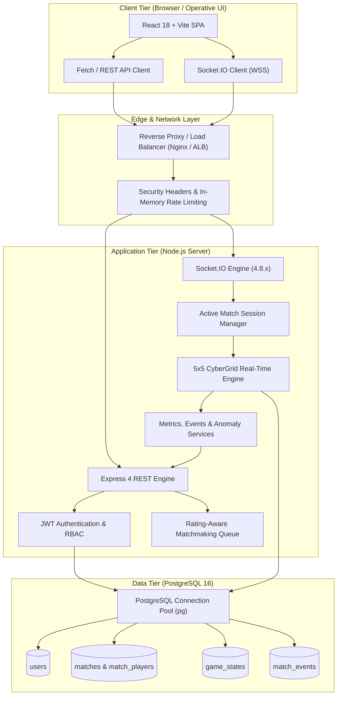
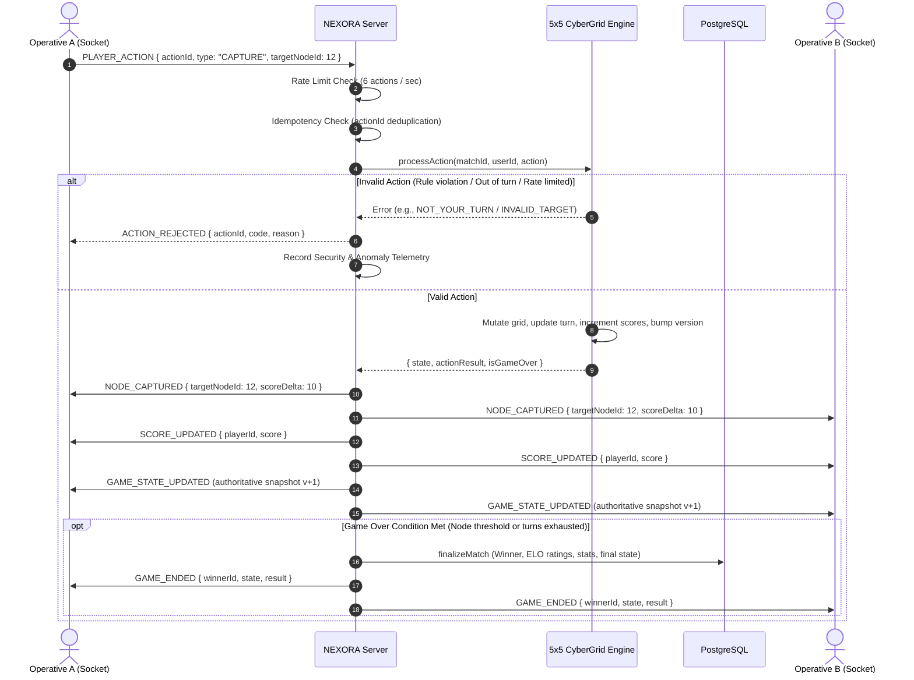
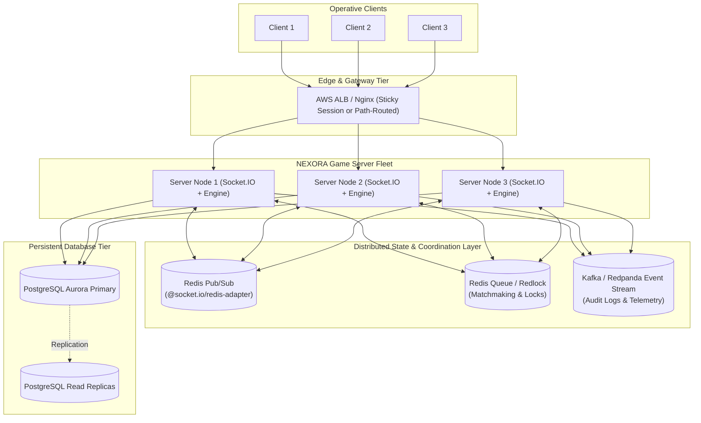

# NEXORA — System Architecture & Scalability Blueprint

> **"Enter the Grid. Outsmart the Network."**  
> NEXORA is a real-time multiplayer competitive cyber-strategy game engineered to showcase production-grade multiplayer infrastructure: server-authoritative state resolution, cryptographic telemetry, operational monitoring, and horizontal scalability.

---

## 1. High-Level System Architecture

NEXORA operates as a modular TypeScript monorepo with strict separation of concerns across shared contracts, frontend presentation, backend business logic, and server-authoritative game simulation.

---

## 2. Real-Time Event & Authoritative Action Flow

NEXORA adheres to the **server-authoritative multiplayer pattern**. Clients never dictate state changes or calculate scores; they transmit player intent (`PLAYER_ACTION`), which the server validates against game rules, turn order, spatial grid connectivity, action idempotency, and rate limits.

---

## 3. Current Single-Instance Architecture & Scaling Boundaries

In the Stage 8 baseline, NEXORA operates as a single high-performance Node.js service running in conjunction with PostgreSQL. This architecture has intentional boundaries:

| Subsystem | Current In-Memory State | Single-Instance Scaling Boundary |
| --- | --- | --- |
| **Matchmaking** | `waitingQueue: QueueEntry[]` in RAM | Players connected to separate Node processes cannot be paired together. |
| **Active Game Sessions** | `ActiveMatchSession` map in RAM | Player A and Player B in the same match must be connected to the exact same server instance. |
| **Presence & Lobby** | `userSockets` and `socketUsers` maps | Presence broadcasts only reach sockets connected to the local instance. |
| **Telemetry & Metrics** | Sliding windows in RAM (`actionTimestamps`, `actionLatencySamples`) | Telemetry dashboard reflects node-local stats rather than fleet-wide aggregate stats. |

---

## 4. Horizontal Scaling Roadmap (Production Architecture)

To scale NEXORA to thousands of concurrent matches across a cluster of containerized nodes, the following incremental architecture is planned:

### Phase 1: Distributed Socket Routing via Redis Adapter

* **Mechanism**: Deploy `@socket.io/redis-adapter` or `@socket.io/redis-streams-adapter`.
* **Impact**: Sockets on Node 1 can broadcast to rooms where members are connected to Node 2 or Node 3. Inter-socket communication is completely transparent.

### Phase 2: Centralized Matchmaking Queue

* **Mechanism**: Move `waitingQueue` into Redis Sorted Sets (`ZSET`) keyed by rating, with atomic leasing via Redis Lua scripts or Redlock.
* **Impact**: Matchmaking becomes distributed and cluster-wide. Any server can pop two matching players from the queue and assign them to an active match room.

### Phase 3: Dedicated Game Engine Worker Routing

* **Mechanism**: Assign matches to dedicated engine processes using consistent hashing on `matchId` or dynamic match coordinator scheduling.
* **Impact**: Decouples lightweight socket proxying from CPU-bound game engine action loops, enabling autoscaling based on active match count.

### Phase 4: Event Streaming & Asynchronous Telemetry

* **Mechanism**: Stream operational events, security alerts, and match history to Apache Kafka or Redpanda.
* **Impact**: Match finalization, ELO recalculation, and audit logging happen asynchronously without blocking the real-time event loop.
